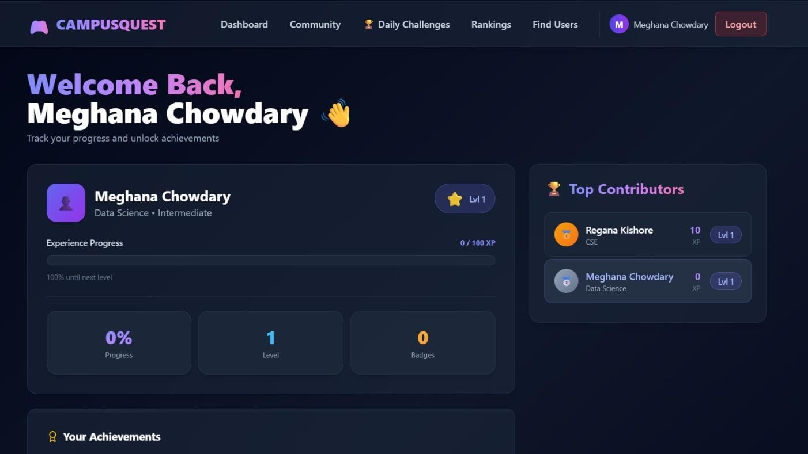
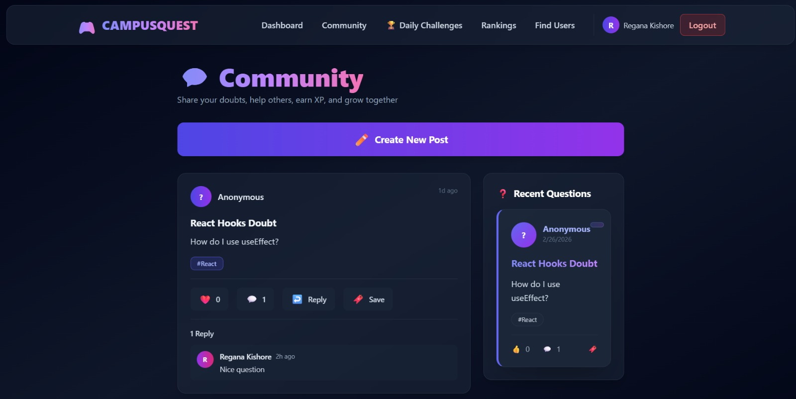
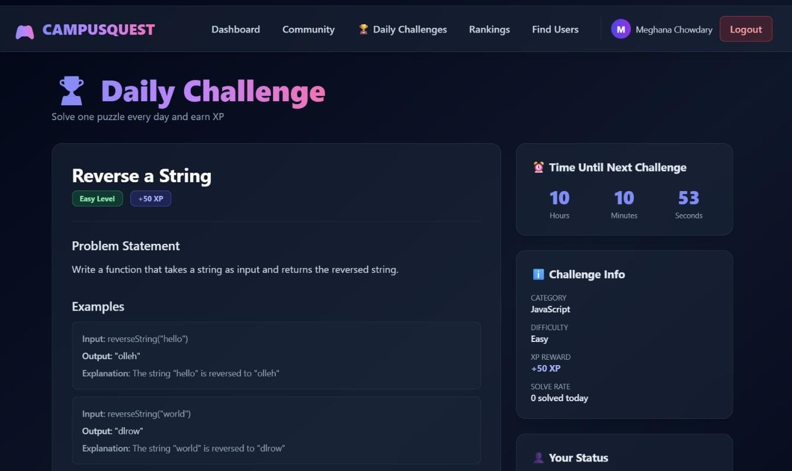
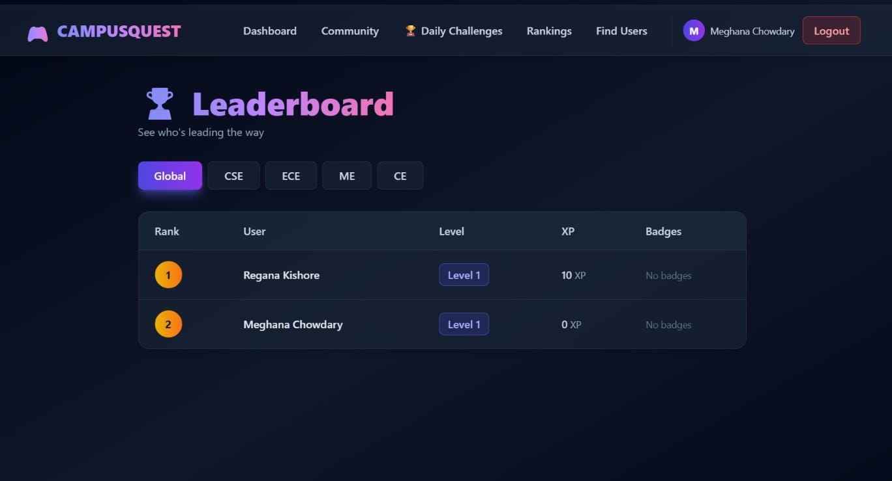

# 🎮 CAMPUSQUEST - Gamified Learning Platform

A comprehensive gamified learning platform that combines community engagement, daily coding challenges, leaderboards, and badge systems to motivate students to learn and grow together.

---

## 📋 Table of Contents

- [Features](#-features)
- [Tech Stack](#-tech-stack)
- [Project Structure](#-project-structure)
- [Installation & Setup](#-installation--setup)
- [Demo Screenshots](#-demo-screenshots)
- [API Endpoints](#-api-endpoints)
- [Database Models](#-database-models)
- [Key Features Explained](#-key-features-explained)
- [User Flow](#-user-flow)

---

## ✨ Features

### Core Features
- 👤 **User Registration & Authentication** - Email-based registration with optional profile pictures
- 🔐 **Secure Login** - localStorage-based session management
- 👥 **Community Posts** - Create, read, update, delete posts with replies
- ❤️ **Post Interactions** - Like posts and add comments with XP rewards
- 🔍 **User Search** - Find users by name or department with privacy controls
- 📊 **Leaderboard** - Global and category-based rankings based on XP

### Gamification Features
- ⭐ **XP System** - Earn experience points for activities:
  - +20 XP for creating a post
  - +10 XP for adding a comment
  - Variable XP for solving challenges
- 🏆 **Badges** - Unlock achievements based on milestones
- 📅 **Daily Challenges** - Solve a new coding puzzle every day with different difficulty levels
- 💡 **AI Suggestions** - Personalized learning recommendations based on skill level and interests
- 🎯 **Contests** - Participate in programming contests and competitions
- 📚 **Course Recommendations** - Get personalized course suggestions

---

## 🛠 Tech Stack

### Frontend
- **React 19** - UI library
- **Vite 7.3.1** - Build tool
- **React Router v7** - Client-side routing
- **Tailwind CSS 3.x** - Styling framework
- **lucide-react** - Icon library
- **Context API** - State management

### Backend
- **Node.js** - JavaScript runtime
- **Express.js** - Web framework
- **MongoDB Atlas** - Cloud database
- **Mongoose** - ODM for MongoDB
- **CORS** - Cross-origin resource sharing
- **dotenv** - Environment variable management

---

## 📁 Project Structure

```
Learning/
├── frontend/
│   ├── src/
│   │   ├── pages/
│   │   │   ├── Register.js          # User registration page
│   │   │   ├── Login.js             # User login page
│   │   │   ├── Dashboard.js         # Main dashboard with suggestions & badges
│   │   │   ├── Community.js         # Community posts feed
│   │   │   ├── DailyChallenges.js   # Daily coding challenges
│   │   │   ├── UserSearch.js        # Find users by name/department
│   │   │   └── LeaderboardPage.js   # Global & category leaderboards
│   │   ├── components/
│   │   │   ├── Navbar.js            # Navigation bar
│   │   │   ├── PostCard.js          # Individual post card
│   │   │   ├── BadgeItem.js         # Badge display component
│   │   │   ├── DoubtFeed.js         # Recent questions sidebar
│   │   │   └── ProfileCard.js       # User profile card
│   │   ├── services/
│   │   │   └── api.js               # All API calls
│   │   ├── hooks/
│   │   │   └── useFetch.js          # Reusable data fetching hook
│   │   ├── context/
│   │   │   └── UserContext.js       # User state management
│   │   ├── assets/
│   │   │   ├── challenges.jpeg      # Daily Challenges screenshot
│   │   │   ├── community.jpeg       # Community page screenshot
│   │   │   ├── dashbard.jpeg        # Dashboard screenshot
│   │   │   ├── leaderboard.jpeg     # Leaderboard screenshot
│   │   │   └── react.svg
│   │   ├── App.jsx                  # Main app component
│   │   └── main.jsx                 # Entry point
│   ├── package.json                 # Dependencies
│   └── vite.config.js               # Vite configuration
│
└── backend/
    ├── models/
    │   ├── User.js                  # User schema
    │   ├── Post.js                  # Post schema
    │   ├── Challenge.js             # Daily challenge schema
    │   ├── Badge.js                 # Badge schema
    │   └── Contest.js               # Contest schema
    ├── routes/
    │   ├── userRoutes.js            # User endpoints
    │   ├── communityRoutes.js       # Community post endpoints
    │   ├── challengeRoutes.js       # Daily challenge endpoints
    │   ├── contestRoutes.js         # Contest endpoints
    │   ├── leaderboardRoutes.js     # Leaderboard endpoints
    │   ├── badgeRoutes.js           # Badge endpoints
    │   └── recommendationRoutes.js  # Recommendation endpoints
    ├── controllers/
    │   ├── userController.js        # User logic
    │   ├── communityController.js   # Post logic
    │   ├── challengeController.js   # Challenge logic
    │   ├── contestController.js     # Contest logic
    │   ├── dashboardController.js   # Dashboard logic
    │   ├── leaderboardController.js # Leaderboard logic
    │   ├── badgeController.js       # Badge logic
    │   └── recommendationController.js  # Recommendation logic
    ├── middleware/
    │   ├── errorHandler.js          # Error handling
    │   ├── logger.js                # Request logging
    │   └── validateInput.js         # Input validation
    ├── utils/
    │   ├── emailService.js          # Email utilities
    │   ├── xpCalculator.js          # XP calculation logic
    │   └── badgeDefinitions.js      # Badge definitions
    ├── scripts/
    │   ├── seedChallenges.js        # Seed initial challenges
    │   └── seeBadges.js
    ├── config/
    │   ├── db.js                    # MongoDB connection
    │   └── constants.js             # Application constants
    ├── server.js                    # Main server file
    └── .env                         # Environment variables
```

---

## 🚀 Installation & Setup

### Prerequisites
- Node.js (v16 or higher)
- MongoDB Atlas account
- npm or yarn package manager

### Backend Setup

1. **Navigate to backend directory:**
   ```bash
   cd backend
   ```

2. **Install dependencies:**
   ```bash
   npm install
   ```

3. **Create `.env` file:**
   ```env
   MONGO_URI=your_mongodb_connection_string
   PORT=5000
   ```

4. **Seed initial data (optional):**
   ```bash
   node scripts/seedChallenges.js
   ```

5. **Start the server:**
   ```bash
   node server.js
   ```
   Server will run on `http://localhost:5000`

### Frontend Setup

1. **Navigate to frontend directory:**
   ```bash
   cd frontend
   ```

2. **Install dependencies:**
   ```bash
   npm install
   ```

3. **Start the development server:**
   ```bash
   npm run dev
   ```
   Frontend will run on `http://localhost:5173`

---

## 📸 Demo Screenshots

### Dashboard
The main dashboard showing user statistics, personalized AI suggestions, and earned badges.



**Features:**
- User statistics (Level, XP, Badges earned)
- Personalized learning suggestions based on skill level
- Achievement badges display
- Quick navigation to other features

---

### Community
Connect with other learners, share doubts, and collaborate.



**Features:**
- Create and share posts with the community
- Like posts and add comments
- Recent questions sidebar (Doubt Feed)
- Delete your own posts
- XP rewards for contributions (+20 for posts, +10 for comments)

---

### Daily Challenges
Solve a new coding challenge every day and earn XP.



**Features:**
- New puzzle every day (changes at midnight)
- Multiple difficulty levels (Easy, Medium, Hard)
- Problem description with examples and hints
- Solution submission form with timer
- Results and XP rewards upon completion

---

### Leaderboard
Compete with other students and track your progress.



**Features:**
- Global XP rankings
- Category-based leaderboards
- Real-time XP updates
- View top performers
- Track your position

---

## 🔌 API Endpoints

### User Routes (`/api/users`)
- `POST /register` - Register new user
- `POST /login` - Login user
- `GET /:userId` - Get user profile
- `PUT /:userId` - Update user profile
- `GET /search?name=&department=` - Search users

### Community Routes (`/api/community`)
- `GET /` - Get all posts
- `POST /create` - Create new post
- `DELETE /:postId` - Delete post
- `POST /comment/:postId` - Add comment
- `POST /like/:postId` - Like post

### Challenge Routes (`/api/challenges`)
- `GET /today` - Get today's challenge
- `POST /submit` - Submit challenge solution
- `GET /history/:userId` - Get user's challenge history

### Leaderboard Routes (`/api/leaderboard`)
- `GET /global` - Global rankings
- `GET /category/:category` - Category rankings
- `GET /:userId/rank` - User's current rank

### Badge Routes (`/api/badges`)
- `GET /` - Get all badges
- `GET /user/:userId` - Get user's badges
- `POST /unlock/:userId/:badgeId` - Unlock badge

### Contest Routes (`/api/contests`)
- `GET /` - Get all contests
- `POST /create` - Create contest
- `GET /:id` - Get contest details
- `POST /:id/join` - Join contest
- `POST /:id/leave` - Leave contest
- `POST /:id/submit` - Submit contest solution

### Recommendation Routes (`/api/recommendations`)
- `GET /:userId` - Get personalized recommendations
- `GET /:userId/courses` - Get recommended courses

---

## 📊 Database Models

### User Model
```javascript
{
  name: String,
  email: String (unique),
  password: String,
  department: String,
  year: Number,
  technicalInterests: [String],
  skillLevel: String (Beginner/Intermediate/Advanced),
  profilePicture: String (Base64),
  xp: Number,
  level: Number,
  badges: [ObjectId],
  solvedChallenges: [ObjectId],
  createdAt: Date
}
```

### Post Model
```javascript
{
  author: ObjectId (User),
  title: String,
  content: String,
  tags: [String],
  upvotes: Number,
  comments: [{
    user: ObjectId (User),
    text: String,
    createdAt: Date
  }],
  createdAt: Date
}
```

### Challenge Model
```javascript
{
  title: String,
  description: String,
  difficulty: String (Easy/Medium/Hard),
  category: String,
  xpReward: Number,
  examples: [{
    input: String,
    output: String
  }],
  hints: [String],
  solution: String,
  dayOfYear: Number,
  solveCount: Number,
  createdAt: Date
}
```

### Badge Model
```javascript
{
  name: String,
  description: String,
  icon: String,
  requirement: Object,
  createdAt: Date
}
```

---

## 🎯 Key Features Explained

### XP System
Users earn experience points for various activities:
- Creating a post: **+20 XP**
- Adding a comment: **+10 XP**
- Solving a daily challenge: **Variable (20-50 XP)**
- Winning a contest: **Variable XP**

Every 100 XP = 1 Level

### Daily Challenges
- A new coding challenge is generated every day (changes at 00:00 UTC)
- Challenges have different difficulty levels affecting XP rewards
- Users can view examples, hints, and submit their solutions
- Solutions are validated and XP is awarded upon correct submission

### Badge System
Users can unlock badges for achievements such as:
- First Post
- Helpful Contributor (10 comments)
- Challenge Master (Solve 10 challenges)
- Top Contributor (100+ XP)
- And more...

### AI Recommendations
The system provides personalized learning suggestions based on:
- User's skill level (Beginner/Intermediate/Advanced)
- Technical interests (Web Development, DSA, ML, etc.)
- Recent activity and challenge performance
- Suggestions rotate daily to encourage exploration

---

## 👥 User Flow

### New User Journey
```
Registration → Complete Profile → Dashboard
                                 ├── View Suggestions
                                 ├── Browse Community
                                 ├── Try Daily Challenge
                                 └── Earn First Badge
```

### Returning User Journey
```
Login → Dashboard → Choose Activity
                    ├── Solve Daily Challenge (XP + Badge)
                    ├── Contribute to Community (XP)
                    ├── Search & Connect with Users
                    └── Check Leaderboard Progress
```

---

## 🔐 Authentication & Security

- Email-based registration with password storage
- localStorage-based session management
- Email fields hidden from public view (privacy-first)
- Only post authors can delete their posts
- Optional profile pictures with Base64 encoding

---

## 🎨 UI/UX Design

- **Modern Dark Theme** - Easy on the eyes, perfect for extended study sessions
- **Glass-morphism Effects** - Elegant, semi-transparent cards
- **Gradient Accents** - Visual hierarchy and brand identity
- **Responsive Design** - Works seamlessly on mobile, tablet, and desktop
- **Intuitive Navigation** - Clear menu structure and user guidance

---

## 📈 Future Enhancements

- [ ] Real-time notifications for new comments/likes
- [ ] Advanced analytics dashboard
- [ ] Peer-to-peer mentorship system
- [ ] Video tutorials integration
- [ ] Mobile app (React Native)
- [ ] Social sharing features
- [ ] Advanced search with filters
- [ ] Coding collaboration tools
- [ ] Certificate generation
- [ ] Integration with coding platforms (LeetCode, HackerRank)

---

## 🤝 Contributing

We welcome contributions! To contribute:

1. Fork the repository
2. Create a feature branch (`git checkout -b feature/AmazingFeature`)
3. Commit your changes (`git commit -m 'Add some AmazingFeature'`)
4. Push to the branch (`git push origin feature/AmazingFeature`)
5. Open a Pull Request

---

## 📄 License

This project is licensed under the MIT License - see the LICENSE file for details.

---

## 📞 Support

For support, email support@campusquest.com or open an issue on the GitHub repository.

---

## 🙏 Acknowledgments

- MongoDB Atlas for database hosting
- Tailwind CSS for styling framework
- React community for excellent documentation
- All contributors and users of CAMPUSQUEST

---

**Built with ❤️ by the CAMPUSQUEST Team**

**Last Updated:** February 28, 2026
